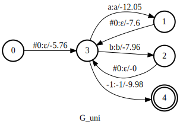

# arpa2fst

Python wrapper for kaldi's [arpa2fst][1].

[][2]

# Installation

`kaldilm` can be installed using either `conda` or `pip`.

## Using conda

```
conda install -c k2-fsa -c conda-forge kaldilm
```

## Using pip

```bash
pip install kaldilm
```

In case it doesn't work using `pip install` (you can't import `_kaldilm`), something
likely failed during the compilation of the native part of this library.
The following steps will show you a more verbose log that can help diagnose the issue:

```bash
# Remove the broken version first
pip uninstall kaldilm
pip install -v --no-cache-dir kaldilm
```

To test that `kaldilm` is installed successfully, run:

```
$ python3 -m kaldilm --help
```

It should display the usage information of `kaldilm`.

Please create an issue [on GitHub](https://github.com/csukuangfj/kaldilm/issues/new)
if you encounter any problems while installing `kaldilm`.

# Usage

First, let us see the usage information of kaldi's arpa2fst:

```bash
kaldi/src/lmbin$ ./arpa2fst
./arpa2fst

Convert an ARPA format language model into an FST
Usage: arpa2fst [opts] <input-arpa> <output-fst>
 e.g.: arpa2fst --disambig-symbol=#0 --read-symbol-table=data/lang/words.txt lm/input.arpa G.fst

Note: When called without switches, the output G.fst will contain
an embedded symbol table. This is compatible with the way a previous
version of arpa2fst worked.

Options:
  --bos-symbol                : Beginning of sentence symbol (string, default = "<s>")
  --disambig-symbol           : Disambiguator. If provided (e. g. #0), used on input side of backoff links, and <s> and </s> are replaced with epsilons (string, default = "")
  --eos-symbol                : End of sentence symbol (string, default = "</s>")
  --ilabel-sort               : Ilabel-sort the output FST (bool, default = true)
  --keep-symbols              : Store symbol table with FST. Symbols always saved to FST if symbol tables are neither read or written
(otherwise symbols would be lost entirely) (bool, default = false)
  --max-arpa-warnings         : Maximum warnings to report on ARPA parsing, 0 to disable, -1 to show all (int, default = 30)
  --read-symbol-table         : Use existing symbol table (string, default = "")
  --write-symbol-table        : Write generated symbol table to a file (string, default = "")
```

`kaldilm` uses the same arguments as kaldi's arpa2fst:

```bash
$ python3 -m kaldilm --help
```

prints

```
usage: Python wrapper of kaldi's arpa2fst [-h] [--bos-symbol BOS_SYMBOL]
                                          [--disambig-symbol DISAMBIG_SYMBOL]
                                          [--eos-symbol EOS_SYMBOL]
                                          [--ilabel-sort ILABEL_SORT]
                                          [--keep-symbols KEEP_SYMBOLS]
                                          [--max-arpa-warnings MAX_ARPA_WARNINGS]
                                          [--read-symbol-table READ_SYMBOL_TABLE]
                                          [--write-symbol-table WRITE_SYMBOL_TABLE]
                                          [--max-order MAX_ORDER]
                                          input_arpa [output_fst]

positional arguments:
  input_arpa            input arpa filename
  output_fst            Output fst filename. If empty, no output file is
                        created.

optional arguments:
  -h, --help            show this help message and exit
  --bos-symbol BOS_SYMBOL
                        Beginning of sentence symbol (default = "<s>")
  --disambig-symbol DISAMBIG_SYMBOL
                        Disambiguator. If provided (e.g., #0), used on input
                        side of backoff links, and <s> and </s> are replaced
                        with epsilons (default = "")
  --eos-symbol EOS_SYMBOL
                        End of sentence symbol (default = "</s>")
  --ilabel-sort ILABEL_SORT
                        Ilabel-sort the output FST (default = true)
  --keep-symbols KEEP_SYMBOLS
                        Store symbol table with FST. Symbols always saved to
                        FST if symboltables are neither read or written
                        (otherwise symbols would be lost entirely) (default =
                        false)
  --max-arpa-warnings MAX_ARPA_WARNINGS
                        Maximum warnings to report on ARPA parsing, 0 to
                        disable, -1 to show all (default = 30)
  --read-symbol-table READ_SYMBOL_TABLE
                        Use existing symbol table (default = "")
  --write-symbol-table WRITE_SYMBOL_TABLE
                        (Write generated symbol table to a file (default = "")
  --max-order MAX_ORDER
                        Maximum order (inclusive) in the arpa file is used to
                        generate the final FST. If it is -1, all ngram data in
                        the file are used.If it is 1, only unigram data are
                        used.If it is 2, only ngram data up to bigram are
                        used.Default is -1.
```

It has one extra argument `--max-order`, which is not present in kaldi's arpa2fst.

## Example usage

Suppose you have an arpa file `input.arpa` with the following content:

```
\data\
ngram 1=4
ngram 2=2
ngram 3=2

\1-grams:
-5.234679	a -3.3
-3.456783	b
0.0000000	<s> -2.5
-4.333333	</s>

\2-grams:
-1.45678	a b -3.23
-1.30490	<s> a -4.2

\3-grams:
-0.34958	<s> a b
-0.23940	a b </s>

\end\
```

and the word symbol table is `words.txt`:

```
<eps>	0
<s>	1
</s>	2
a	3
b	4
#0 5
```

You can use the following code to convert it into an FST.

### 3-gram

This uses all n-gram data inside the arpa file.

```
  python3 -m kaldilm \
    --read-symbol-table="./words.txt" \
    --disambig-symbol='#0' \
    ./input.arpa > G_fst.txt
```

The resulting `G_fst.txt` is shown in the following

```
3	5	3	3	3.00464
3	0	5	0	5.75646
0	1	3	3	12.0533
0	2	4	4	7.95954
0	9.97787
1	4	4	4	3.35436
1	0	5	0	7.59853
2	0	5	0
4	2	5	0	7.43735
4	0.551239
5	4	4	4	0.804938
5	1	5	0	9.67086
```

which can be visualized in [k2][3] using

```python
import k2
with open('G_fst.txt') as f:
  G = k2.Fsa.from_openfst(f.read(), acceptor=False)
G.symbols = k2.SymbolTable.from_file('words.txt')
G.aux_symbols = k2.SymbolTable.from_file('words.txt')
# G.labels[G.labels == 5] = 0 # convert #0 to eps
G.draw('G.svg', title='G')
```

`G.svg` is shown below:


### 1-gram

It uses only uni-gram data inside the arpa file
since `--max-order=1` is used.

```
  python3 -m kaldilm \
    --read-symbol-table="./words.txt" \
    --disambig-symbol='#0' \
    --max-order=1 \
    ./input.arpa > G_uni_fst.txt
```

The generated `G_uni_fst.txt` is

```
3	0	5	0	5.75646
0	1	3	3	12.0533
0	2	4	4	7.95954
0	9.97787
1	0	5	0	7.59853
2	0	5	0
```

which can be visualized in [k2][3] using

```python
import k2
with open('G_uni_fst.txt') as f:
  G = k2.Fsa.from_openfst(f.read(), acceptor=False)
G.symbols = k2.SymbolTable.from_file('words.txt')
G.aux_symbols = k2.SymbolTable.from_file('words.txt')
# G.labels[G.labels == 5] = 0 # convert #0 to eps
G.draw('G_uni.svg', title='G_uni')
```

`G_uni.svg` is shown below:



## What's more

Please refer to <https://github.com/k2-fsa/snowfall/blob/master/egs/librispeech/asr/simple_v1/run.sh>
for how `kaldilm` is used in [snowfall][4].


[4]: https://github.com/k2-fsa/snowfall/
[3]: https://github.com/k2-fsa/k2
[2]: https://colab.research.google.com/drive/1rTGQiDDlhE8ezTH4kmR4m8vlvs6lnl6Z?usp=sharing
[1]: https://github.com/kaldi-asr/kaldi/blob/master/src/lmbin/arpa2fst.cc
